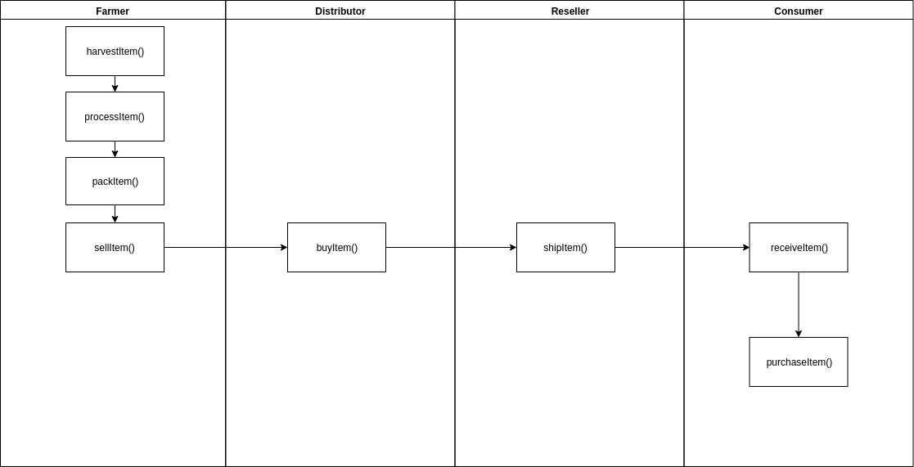
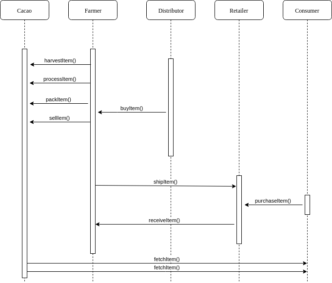
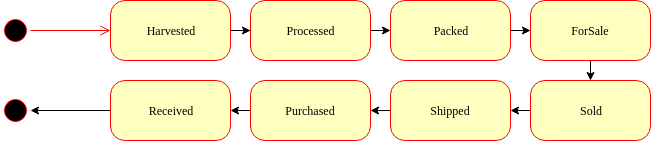
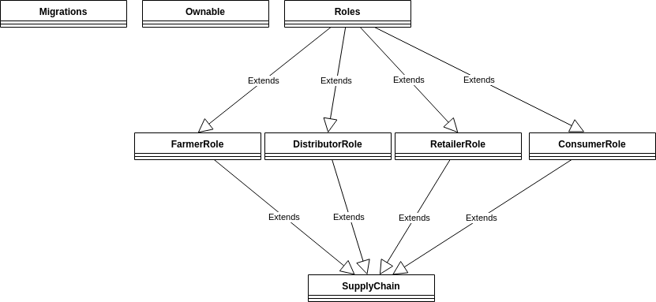

# Project Writeup

## Contract address
TxID: 0x81745a0996e5cf4bd60ade0810c2ec605a5e828da55d37607614189f4c3f3c89
ContractID: 0xb2e4Cd84b0994c7B1Da27F97dd2f1f88a0c12bF2

## Libraries
##### "lite-server": "^2.5.3"
Web server for local testing
##### "ganache-cli": "^6.4.5"
Local Ethereum blockchain
##### "truffle": "5.0.27"
Framework for deploing smart contracts
##### "truffle-assertions": "^0.9.1"
Assertions library for testing on events
##### "truffle-hdwallet-provider": "^1.0.14"
HDWalletProvider for Infura deployment

## Version Numbers
- Truffle v5.0.27 (core: 5.0.27)
- Solidity v0.5.0 (solc-js)
- Node v11.15.0
- Web3.js v1.0.0-beta.37

## UML documents
### Activity

### Sequence

### State

### Class (Data Model)

